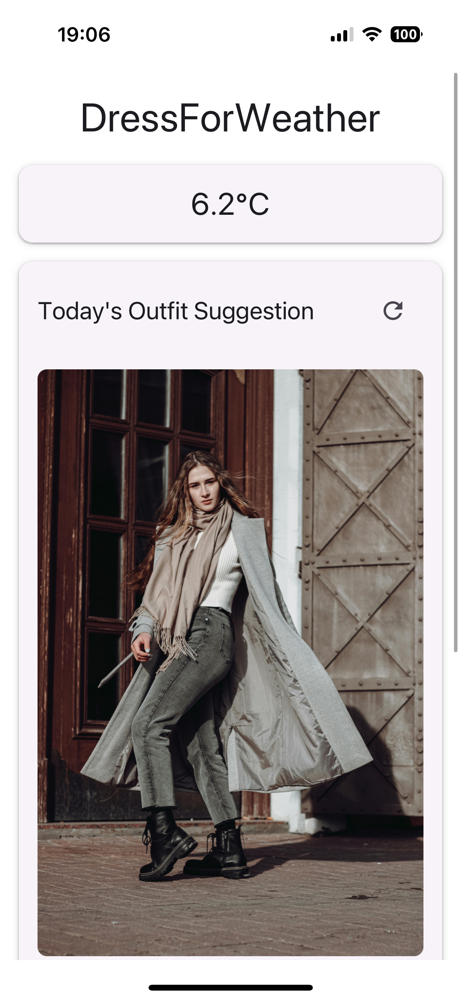
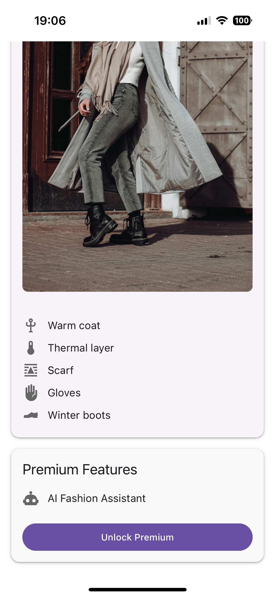
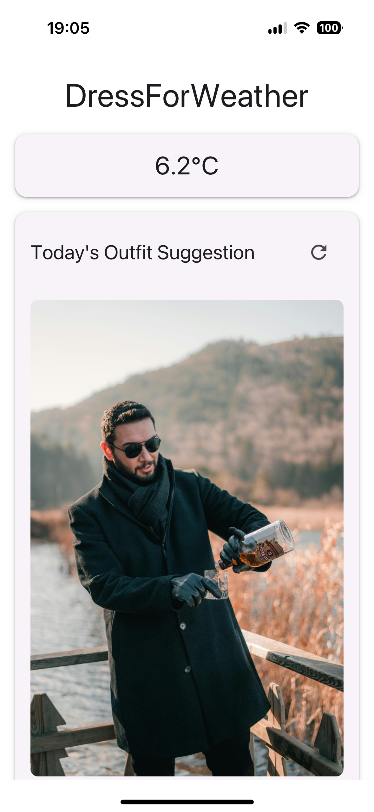
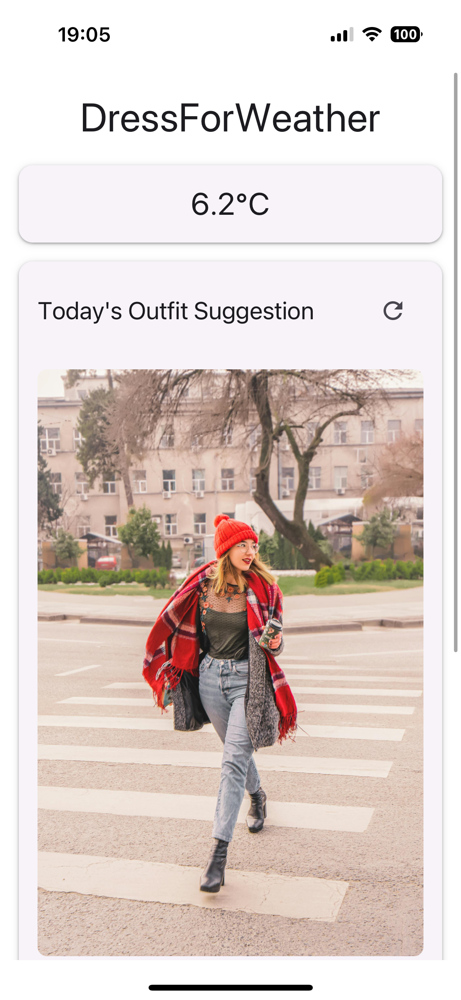
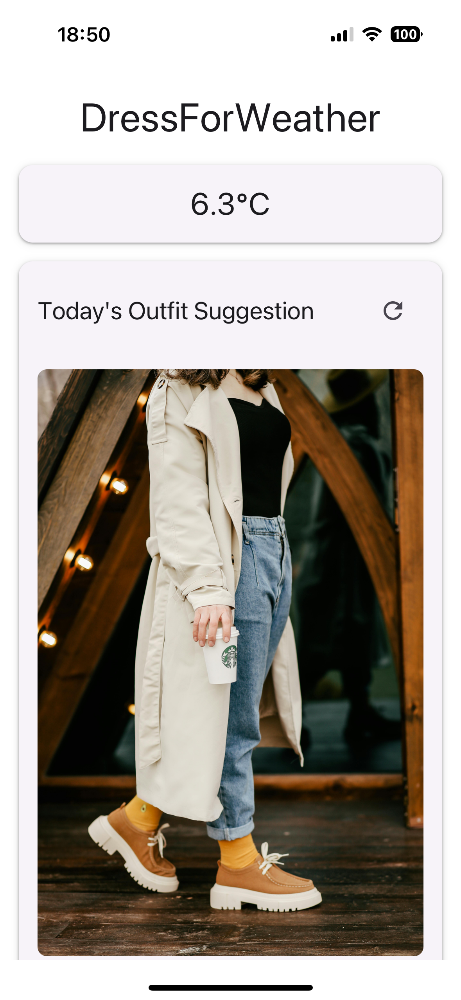

# DressForWeather

A React Native mobile application that suggests daily outfit combinations based on weather conditions and location.

## Screenshots

<p align="center">
  
    
  
  
</p>
<p align="center">
  

</p>

The app provides:
- Real-time weather information
- Weather-appropriate outfit suggestions with multiple options
- Visual outfit inspiration from Pexels
- Easy refresh for different outfit ideas

## Features

- Real-time weather data based on location
- Smart outfit recommendations based on temperature and weather conditions
- Dynamic outfit images that match the weather
- Premium features (coming soon) including AI Fashion Assistant

## Tech Stack

- React Native with Expo
- TypeScript
- React Native Paper for UI components
- OpenMeteo API for weather data
- Pexels API for outfit images

## Setup

1. Clone the repository:
```bash
git clone https://github.com/MelihCelik00/DressForWeather.git
cd DressForWeather
```

2. Install dependencies:
```bash
npm install
```

3. Create a `.env` file in the root directory and add your Pexels API key:
```
EXPO_PUBLIC_PEXELS_API_KEY=your_pexels_api_key_here
```

4. Start the development server:
```bash
npx expo start
```

## Environment Setup

- Node.js >= 18
- Expo CLI
- iOS Simulator or Android Emulator (optional)
- Expo Go app on your physical device (for testing)

## Project Structure

```
src/
  ├── components/      # React components
  ├── types/          # TypeScript type definitions
  ├── utils/          # Utility functions
  └── App.tsx         # Main application file
assets/
  └── screenshots/    # App screenshots
```

## Contributing

Pull requests are welcome. For major changes, please open an issue first to discuss what you would like to change.

## License

[MIT](https://choosealicense.com/licenses/mit/) 